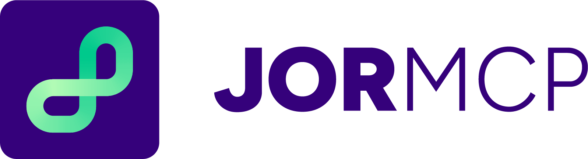

---

<p align="center" height="120em"></p>

---

[Read in English](README.md) | [Leia em Português](README_pt-br.md)

---

## Estado

[](#license) [](#installation-via-docker)

### ⚠️ Estado do Projeto: Beta

O estado atual de lançamento do `jor-mcp` é **Beta**.
*   **Características:**
    *   Convites limitados e seletivos.
    *   Requer cadastro e aprovação prévia dos usuários.
    *   Muitas vezes com NDA (Acordo de Não Divulgação) em projetos comerciais.
*   **Objetivo:**
    *   Validar a experiência do usuário (UX) com pessoas reais.
    *   Testar a carga do servidor com um número controlado de usuários simultâneos.
    *   Detectar problemas específicos de contexto regional/configuração.
*   **Vantagens sobre Alpha:** Maior diversidade de perfis de teste sem risco à marca pública.

### 🚀 Participe do nosso Piloto de Replicação!

Estamos nos preparando para testar a **replabilidade** do `jor-mcp`, instalando e adaptando-o na infraestrutura de outra **organização de jornalismo parceira**.
*   **A Rodada Piloto:** Selecionaremos **um parceiro piloto** inicial para receber suporte prático e personalizado de implantação.
*   **O Objetivo:** Esta primeira rodada servirá para refinar nossos manuais, gerando um **Playbook de Replicação** definitivo, além de templates de **Infraestrutura como Código (IaC)** e **Configuração como Código (CaC)** para facilitar a replicação autônoma para futuras organizações.
*   **Quer participar?** Se a sua redação tem interesse em pilotar buscas seguras de IA sobre WordPress e GitHub, **entre em contato conosco** para manifestar interesse!

---

## Sobre

`jor-mcp` é um servidor [Model Context Protocol (MCP)](https://modelcontextprotocol.io/) de código aberto projetado especificamente para organizações jornalísticas.

Originalmente desenvolvido pela [Ambiental Media](https://ambiental.media/) com apoio de iniciativas globais de jornalismo, este servidor preenche a lacuna entre Grandes Modelos de Linguagem (LLMs) e a infraestrutura padrão das redações, permitindo que agentes de IA pesquisem, recuperem e analisem conteúdo com segurança em instâncias do WordPress e repositórios GitHub internos da sua organização.

Ao implantar sua própria instância do `jor-mcp`, sua redação pode capacitar fluxos de trabalho de IA para verificar fatos contra seus próprios arquivos, resumir relatórios internos e acessar dados proprietários com segurança.

## Funcionalidades

*   **Integração com WordPress:** Pesquise artigos publicados, recupere conteúdo completo e analise metadados diretamente do CMS da sua redação.
*   **Integração com GitHub:** Consulte repositórios internos, pesquise dados e bases de código associadas às suas investigações jornalísticas.
*   **Acesso Seguro:** A autenticação baseada em token (JWT) garante que apenas agentes de IA autorizados ou sistemas internos possam acessar seus dados.
*   **Containerizado:** Fácil de implantar em qualquer lugar usando Docker.
*   **Facilmente Forkável:** Projetado para ser facilmente clonado, configurado via variáveis de ambiente e implantado em infraestrutura de nuvem padrão.

## Documentação

A documentação abrangente para todos os públicos está disponível no diretório [`docs/`](docs/):
*   [Arquitetura Técnica](docs/pt-br/1-tecnico/)
*   [Guias de Replicação](docs/pt-br/2-replicacao/)
*   [Histórico e Especificações](docs/pt-br/3-historico-e-specs/)
*   [Marco Legal](docs/pt-br/4-legal/)

## Primeiros Passos

### Pré-requisitos

Para executar sua própria instância do `jor-mcp`, você só precisa de um runtime de container:
*   [Docker](https://www.docker.com/) (ou alternativas de código aberto como [Colima](https://github.com/abiosoft/colima) ou [Podman](https://podman.io/)).

### Instalação via Docker (Recomendado)

A maneira mais fácil de executar o `jor-mcp` é via Docker.

1.  **Baixe a imagem:**
    *(Placeholder: `docker pull ghcr.io/ambiental-media/jor-mcp:latest`)*

2.  **Configure as Variáveis de Ambiente:**
    Crie um arquivo `.env` para configurar os pontos de acesso específicos da sua redação:
    ```env
    WORDPRESS_API_URL=https://yoursite.com/wp-json/wp/v2
    MCP_GITHUB_TOKEN=your_github_personal_access_token
    JWT_SECRET=your_secure_random_string_for_auth
    PORT=8080
    ```

3.  **Construa e execute o container:**
    Você pode construir e iniciar o servidor instantaneamente usando o Makefile fornecido:
    ```bash
    make run
    ```

## Configuração para sua Redação

Para adaptar o `jor-mcp` para sua organização específica, basta atualizar as variáveis de ambiente no seu arquivo `.env`. A lógica central foi projetada para ser agnóstica e consultará dinamicamente os endpoints do WordPress e GitHub que você fornecer.

Para opções detalhadas de configuração (como configurar o arquivo `.env` para sua redação específica) e guias de implantação para vários provedores de nuvem, consulte nossos **[Guias de Replicação](docs/pt-br/2-replicacao/)**.

## Avançado: Instalação a partir do Código-Fonte (Para Desenvolvedores)

Se você deseja modificar o código ou executar o servidor fora de um container, será necessário instalá-lo a partir do código-fonte.

1.  **Pré-requisitos:** Python 3.12+ e [`uv`](https://docs.astral.sh/uv/).
2.  **Clone o repositório:** `git clone https://github.com/ambiental-media/jor-mcp.git`
3.  **Instale as dependências:** `uv sync`
4.  **Execute o servidor:** `uv run uvicorn src.server:app --host 0.0.0.0 --port 8080`

## Usando o Servidor MCP

Uma vez implantado, você pode conectar sua interface de LLM preferida (por exemplo, Claude Desktop, agentes de IA personalizados) à sua instância do `jor-mcp` usando o protocolo padrão Model Context Protocol.

Para instruções sobre como conectar o Claude Desktop ou outros agentes de IA, consulte nossa **[Documentação Técnica](docs/pt-br/1-tecnico/)**.

## Contribuição

Recebemos contribuições de outras organizações jornalísticas e da comunidade de código aberto!

Por favor, leia nossas [Diretrizes de Contribuição](docs/CONTRIBUTING_DOCS_PTBR.md) para aprender sobre nossos padrões de desenvolvimento, configuração de ambiente e requisitos de qualidade de código antes de enviar um Pull Request.

Agentes de IA que auxiliam neste repositório devem seguir as regras em [AGENTS.md](AGENTS.md).

## Agradecimentos & Financiamento

O desenvolvimento do `jor-mcp` foi possível graças ao apoio generoso de duas grandes iniciativas globais de jornalismo:

*   **[JournalismAI Innovation Challenge](https://www.journalismai.info/programmes/innovation):** Apoiado pela "JournalismAI" (um projeto da POLIS Journalism na LSE) e pela "Google News Initiative", visando o ecossistema jornalístico global.
*   **[Codesinfo](https://codesinfo.com.br/en/home-english/):** Apoiado pelo "Projor" e pela "Google News Initiative", visando o ecossistema jornalístico brasileiro.

## Roadmap

*   [🚀 Roadmap](docs/pt-br/3-historico-e-specs/roadmap.md)

## Licença

*(Placeholder: A licença de código aberto para este projeto ainda não foi determinada. Verifique mais tarde para detalhes de licenciamento.)*
