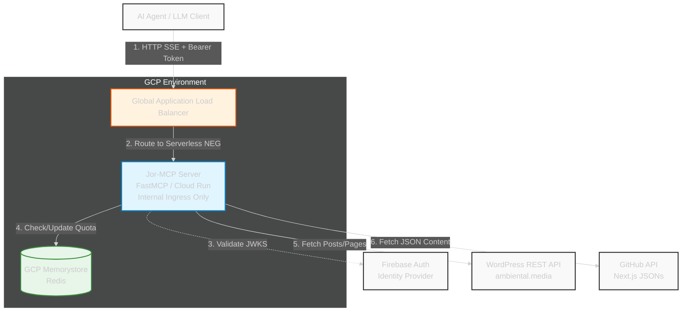
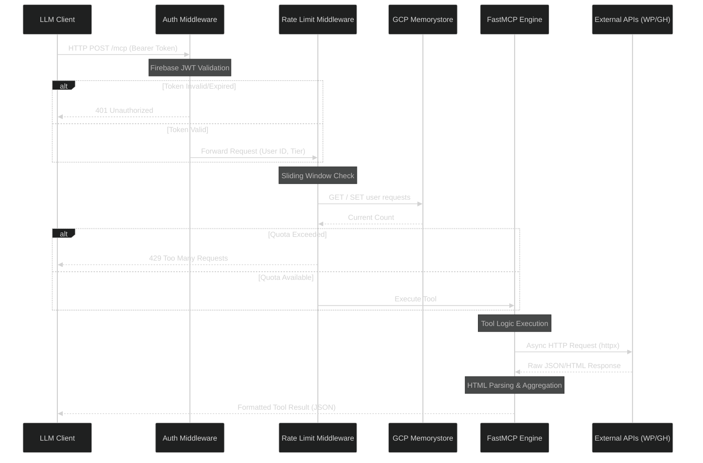

# Jor-MCP Architecture

This document provides a high-level overview of the Jor-MCP system architecture, detailing how components interact with external systems and illustrating the lifecycle of an incoming request.

## 1. System Context Diagram (C4 Level 1)

This diagram illustrates the Jor-MCP server in its environment. It acts as an orchestrator, receiving requests from an AI Agent (Client), validating authentication via Firebase, applying rate limits via Redis, and fetching data from WordPress and GitHub.

## 2. Request Lifecycle (Sequence Diagram)

This sequence diagram details the strict order of operations for every incoming request. It highlights the security layers (Auth and Rate Limiting) executing before the business logic (FastMCP Tools).

## 3. Core Technologies

- **Framework:** `fastmcp` (ASGI server powered by `uvicorn`).
- **HTTP Client:** `httpx` (Asynchronous connection pooling).
- **Security:** `firebase-admin` (JWT validation) and `redis.asyncio` (Rate limiting).
- **Telemetry:** OpenTelemetry (`opentelemetry-sdk`, `opentelemetry-instrumentation-fastapi`).
