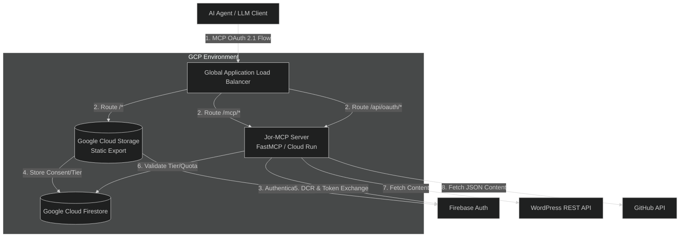
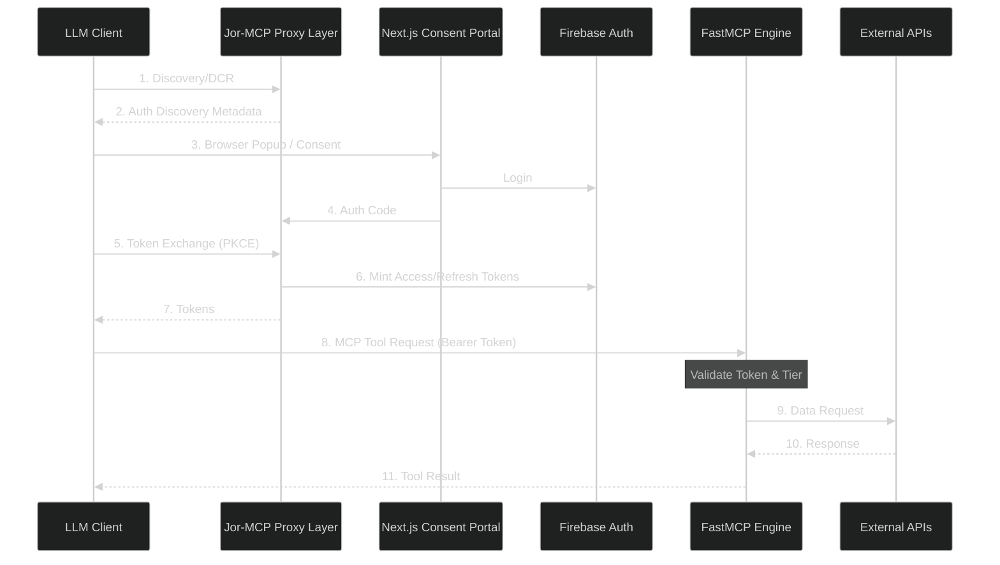

---

# Jor-MCP Architecture

This document provides a high-level overview of the Jor-MCP system architecture, detailing how components interact with external systems and illustrating the lifecycle of an incoming request.

## 1. System Context Diagram (C4 Level 1)

This diagram illustrates the Jor-MCP system, including the interaction between the Claude Desktop client, the Python API Server (acting as an OAuth Proxy), and the Portal for user consent.

## 2. Request Lifecycle (Sequence Diagram)

This diagram details the Native MCP OAuth 2.1 flow.

## 3. Core Technologies

- **Frontend Hosting:** `Google Cloud Storage` and `Cloud CDN` for global edge caching of static Next.js assets.
- **Framework:** `fastmcp` (ASGI server powered by `uvicorn`).
- **HTTP Client:** `httpx` (Asynchronous connection pooling).
- **Security:** `firebase-admin` (JWT validation) and `google-cloud-firestore` (Rate limiting).
- **Telemetry:** OpenTelemetry (`opentelemetry-sdk`, `opentelemetry-instrumentation-fastapi`).

## 4. Key Architectural Patterns

### 4.1 Data Validation Layer
All external data ingress (API responses from WordPress/GitHub, environment variables, client requests) must pass through a **Pydantic v2** validation layer. This ensures that the core application logic, which is statically checked by Mypy, only ever operates on guaranteed, type-safe structures.

### 4.2 Telemetry & Observability
The application relies strictly on **OpenTelemetry Auto-Instrumentation**. Traces, metrics, and logs are automatically collected from the ASGI layer (FastMCP/Starlette), HTTP clients (`httpx`), and standard Python `logging`.
- **No Manual Tracing:** Developers should avoid importing `opentelemetry` SDK components into business logic.
- **Logging:** Use the standard Python `logging` module. All logs are automatically intercepted, enriched with trace contexts, and exported via OTLP to the configured observability backend.
