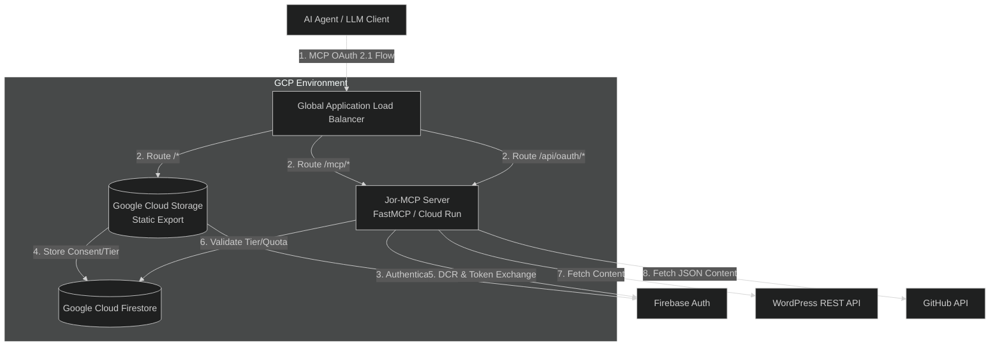
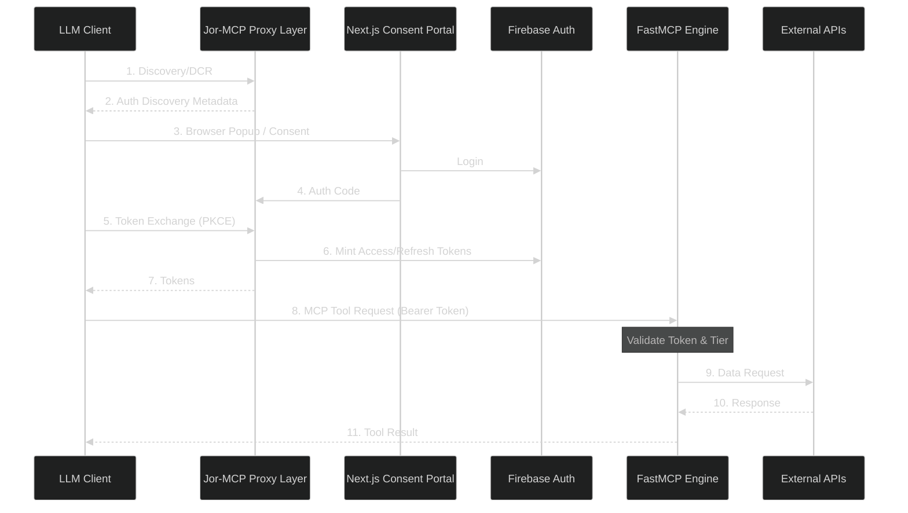

---

# Jor-MCP Architecture

This document provides a high-level overview of the Jor-MCP system architecture, detailing how components interact with external systems and illustrating the lifecycle of an incoming request.

## 1. System Context Diagram (C4 Level 1)

This diagram illustrates the Jor-MCP system, including the interaction between the Claude Desktop client, the Python API Server (acting as an OAuth Proxy), and the Portal for user consent.

```mermaid
%%{init: {'theme': 'dark'}}%%
graph TD
    %% External Actors
    Client[AI Agent / LLM Client]
    
    %% Core System
    subgraph GCP Environment
        LB[Global Application Load Balancer]
        GCSBucket[(Google Cloud Storage \n Static Export)]
        JorMCP[Jor-MCP Server \n FastMCP / Cloud Run]
        Firestore[(Google Cloud Firestore)]
    end
    
    %% External Services
    FirebaseAuth[Firebase Auth]
    WP[WordPress REST API]
    GH[GitHub API]

    %% Relationships
    Client -- "1. MCP OAuth 2.1 Flow" --> LB
    LB -- "2. Route /mcp/*" --> JorMCP
    LB -- "2. Route /api/oauth/*" --> JorMCP
    LB -- "2. Route /*" --> GCSBucket
    
    GCSBucket -- "3. Authenticate User" --> FirebaseAuth
    GCSBucket -- "4. Store Consent/Tier" --> Firestore
    
    JorMCP -- "5. DCR & Token Exchange" --> FirebaseAuth
    JorMCP -- "6. Validate Tier/Quota" --> Firestore
    
    JorMCP -- "7. Fetch Content" --> WP
    JorMCP -- "8. Fetch JSON Content" --> GH
    
    class Client,FirebaseAuth,WP,GH external;
    class JorMCP,GCSBucket internal;
    class LB gateway;
    class Firestore db;
```

## 2. Request Lifecycle (Sequence Diagram)

This diagram details the Native MCP OAuth 2.1 flow.

```mermaid
%%{init: {'theme': 'dark'}}%%
sequenceDiagram
    participant C as LLM Client
    participant Proxy as Jor-MCP Proxy Layer
    participant Portal as Next.js Consent Portal
    participant Auth as Firebase Auth
    participant MCP as FastMCP Engine
    participant Ext as External APIs

    C->>Proxy: 1. Discovery/DCR
    Proxy-->>C: 2. Auth Discovery Metadata
    
    C->>Portal: 3. Browser Popup / Consent
    Portal->>Auth: Login
    Portal->>Proxy: 4. Auth Code
    
    C->>Proxy: 5. Token Exchange (PKCE)
    Proxy->>Auth: 6. Mint Access/Refresh Tokens
    Proxy-->>C: 7. Tokens

    C->>MCP: 8. MCP Tool Request (Bearer Token)
    Note over MCP: Validate Token & Tier
    MCP->>Ext: 9. Data Request
    Ext-->>MCP: 10. Response
    MCP-->>C: 11. Tool Result
```

## 3. Core Technologies

- **Frontend Hosting:** `Google Cloud Storage` and `Cloud CDN` for global edge caching of static Next.js assets.
- **Framework:** `fastmcp` (ASGI server powered by `uvicorn`).
- **HTTP Client:** `httpx` (Asynchronous connection pooling).
- **Security:** `firebase-admin` (JWT validation) and `google-cloud-firestore` (Rate limiting).
- **Telemetry:** OpenTelemetry (`opentelemetry-sdk`, `opentelemetry-instrumentation-starlette`, `opentelemetry-instrumentation-httpx`).

## 4. Key Architectural Patterns

### 4.1 Data Validation Layer
All external data ingress (API responses from WordPress/GitHub, environment variables, client requests) must pass through a **Pydantic v2** validation layer. This ensures that the core application logic, which is statically checked by Mypy, only ever operates on guaranteed, type-safe structures.

### 4.2 Telemetry & Observability
Tracing relies on **OpenTelemetry Auto-Instrumentation**: spans are collected from the ASGI layer (FastMCP/Starlette) and from HTTP clients (`httpx`). Logs take a separate path — they are **not** exported through OTLP.
- **No Manual Tracing:** Developers should avoid importing `opentelemetry` SDK components into business logic.
- **Logging:** Use the standard Python `logging` module. `src/telemetry.py` owns the process-wide configuration: a single handler writes every record to stdout as one line of JSON in the schema Cloud Logging expects, and the runtime collects it from the container's output. A logging filter reads the active span and attaches the trace context to each record, which is what correlates a log entry with its request.
- **Third-Party Handlers:** Libraries that install their own handlers (uvicorn, FastMCP, MCP) have them stripped at startup so their records reach the same JSON handler. Without that, a multi-line traceback written as plain text is ingested as one log entry per line.
- **Span Export:** Opt-in through `OTEL_TRACES_EXPORTER`, which defaults to `none`. Spans are always created — that is where the trace context on each log record comes from — but reach a backend only when export is explicitly enabled.
