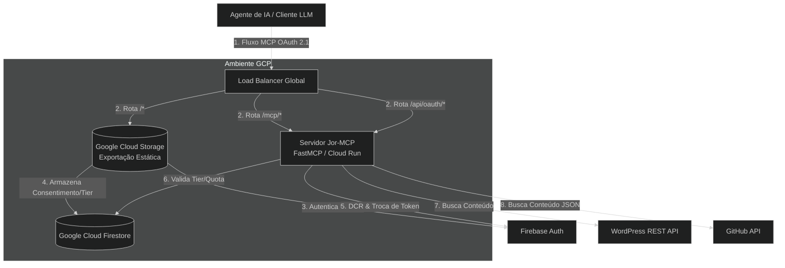
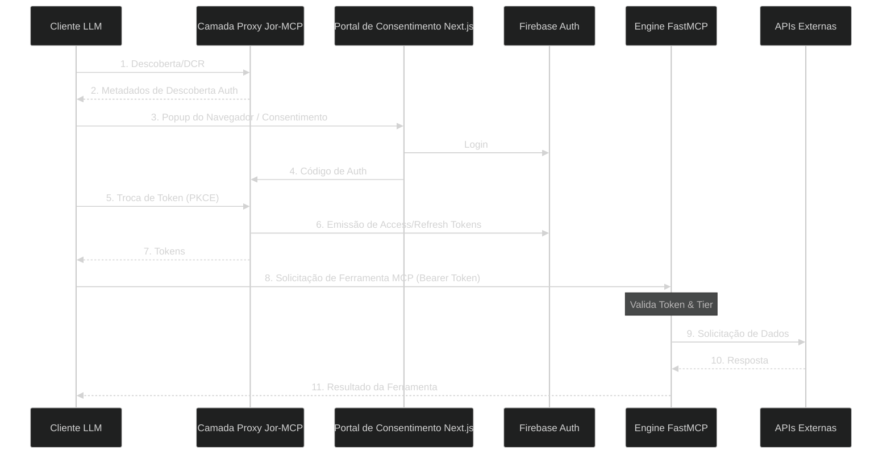

---

# Arquitetura do Jor-MCP

Este documento fornece uma visão geral de alto nível da arquitetura do sistema Jor-MCP, detalhando como os componentes interagem com sistemas externos e ilustrando o ciclo de vida de uma solicitação recebida.

## 1. Diagrama de Contexto do Sistema (C4 Nível 1)

Este diagrama ilustra o sistema Jor-MCP, incluindo a interação entre o cliente Claude Desktop, o Servidor de API em Python (atuando como um Proxy OAuth) e o Portal para consentimento do usuário.

## 2. Ciclo de Vida da Solicitação (Diagrama de Sequência)

Este diagrama detalha o fluxo nativo do MCP OAuth 2.1.

## 3. Tecnologias Principais

- **Hospedagem Frontend:** `Google Cloud Storage` e `Cloud CDN` para cache global na borda (edge) dos ativos estáticos do Next.js.
- **Framework:** `fastmcp` (Servidor ASGI impulsionado pelo `uvicorn`).
- **Cliente HTTP:** `httpx` (Pool de conexões assíncronas).
- **Segurança:** `firebase-admin` (validação de JWT) e `google-cloud-firestore` (limitação de taxa).
- **Telemetria:** OpenTelemetry (`opentelemetry-sdk`, `opentelemetry-instrumentation-fastapi`).

## 4. Padrões de Arquitetura Chave

### 4.1 Camada de Validação de Dados
Toda entrada de dados externos (respostas de API do WordPress/GitHub, variáveis de ambiente, solicitações de clientes) deve passar por uma camada de validação do **Pydantic v2**. Isso garante que a lógica principal da aplicação, verificada estaticamente pelo Mypy, opere apenas em estruturas garantidas e seguras quanto ao tipo (type-safe).

### 4.2 Telemetria e Observabilidade
A aplicação depende estritamente da **Auto-Instrumentação do OpenTelemetry**. Rastreamentos (traces), métricas e logs são coletados automaticamente a partir da camada ASGI (FastMCP/Starlette), clientes HTTP (`httpx`) e do módulo padrão `logging` do Python.
- **Sem Rastreamento Manual:** Os desenvolvedores devem evitar a importação de componentes do SDK do `opentelemetry` na lógica de negócios.
- **Registro de Logs:** Use o módulo padrão `logging` do Python. Todos os logs são automaticamente interceptados, enriquecidos com contextos de rastreamento e exportados via OTLP para o backend de observabilidade configurado.
