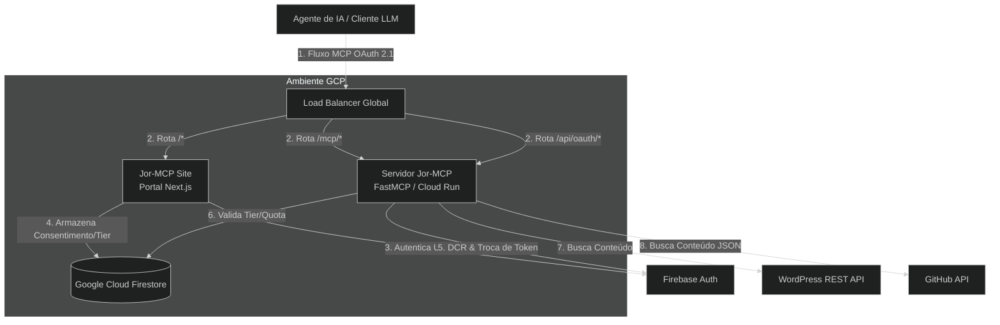
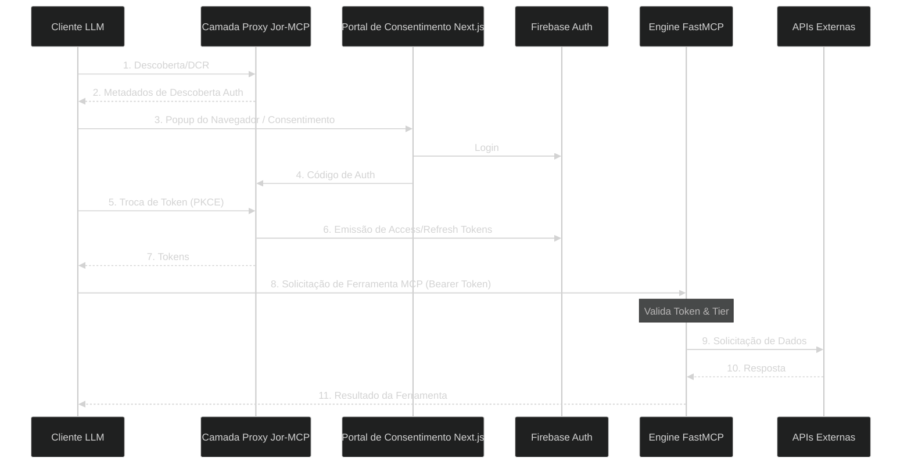

# Arquitetura do Jor-MCP

Este documento fornece uma visão geral de alto nível da arquitetura do sistema Jor-MCP, detalhando como os componentes interagem com sistemas externos e ilustrando o ciclo de vida de uma solicitação recebida.

## 1. Diagrama de Contexto do Sistema (C4 Nível 1)

Este diagrama ilustra o sistema Jor-MCP, incluindo a interação entre o cliente Claude Desktop, o Servidor de API em Python (atuando como um Proxy OAuth) e o Portal para consentimento do usuário.

## 2. Ciclo de Vida da Solicitação (Diagrama de Sequência)

Este diagrama detalha o fluxo nativo do MCP OAuth 2.1.

## 3. Tecnologias Principais

- **Framework:** `fastmcp` (Servidor ASGI impulsionado pelo `uvicorn`).
- **Cliente HTTP:** `httpx` (Pool de conexões assíncronas).
- **Segurança:** `firebase-admin` (validação de JWT) e `google-cloud-firestore` (limitação de taxa).
- **Telemetria:** OpenTelemetry (`opentelemetry-sdk`, `opentelemetry-instrumentation-fastapi`).
